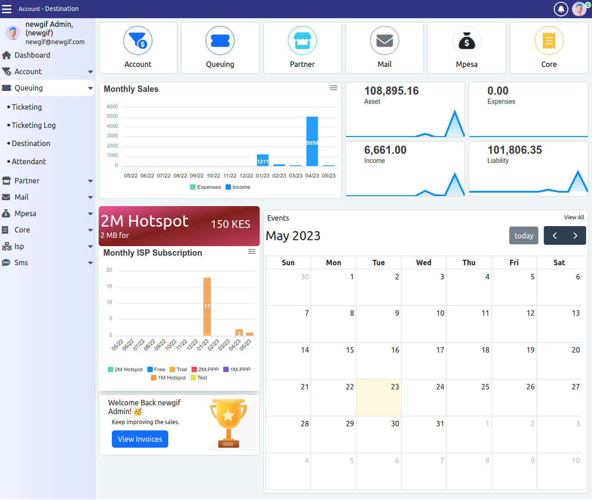

# Getting started

  

### About Mybizna

Mybizna is an open-source ERP (Enterprise Resource Planning) solution for Laravel. It is developed using Laravel which is a web application framework with expressive, elegant syntax. We believe development must be an enjoyable and creative experience to be truly fulfilling.

<figure><figcaption>
mybizna-erp dashboard
</figcaption></figure>

### Core Components

* HRM - Human Resource Management
* CRM - Customer Relationship Management
* Accounting - Double Entry Accounting

### Minimum Requirement

* PHP 8.1^

